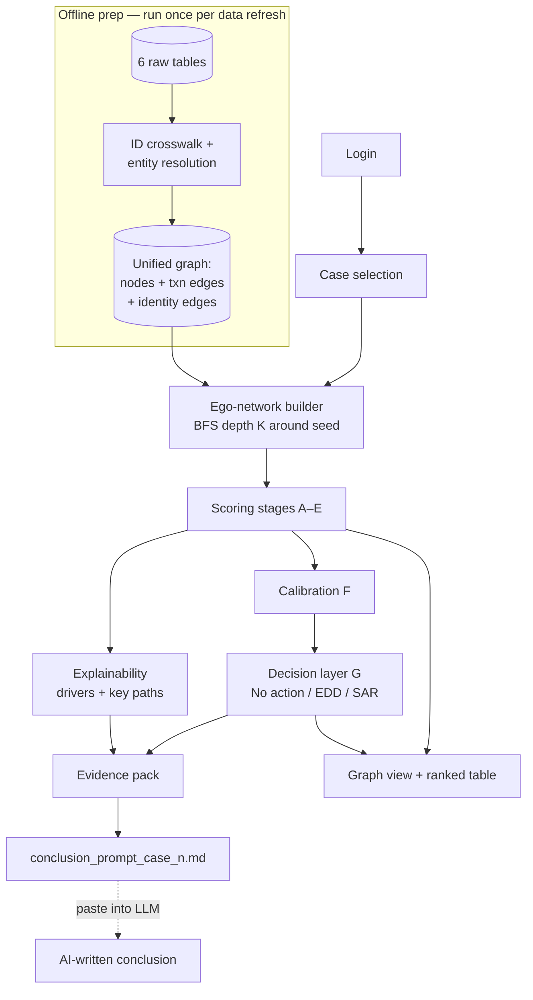

# Architecture

Counterparty network risk at the point of review for AML investigators.
Given a case subject, the engine builds the subject's ego-network from six
relational tables, scores every connected entity with a transparent staged
pipeline, turns the calibrated score into **{No action, EDD, SAR}**, explains
the drivers, and writes a grounded LLM prompt file for the case conclusion.

Companion docs: [DATA.md](DATA.md) (tables & identity resolution) ·
[SCORING.md](SCORING.md) (stages A–H & decision layer) ·
[APP.md](APP.md) (the analyst screen).

## Design principles

1. **Explainable by construction.** Every stage's output is an inspectable
   column; the aggregate is a documented weighted sum, so driver attribution
   is *exact*, not approximated. Required by the brief and SR 11-7.
2. **The 3 outputs come from a decision layer, not a black box.** With only
   6 labelled subjects and 692 weak alert labels, a supervised 3-class model
   would memorize, not learn. The learned model is a designed-in v2 upgrade
   (Stage H) behind a clean seam — see SCORING.md.
3. **Nothing is hard-coded to the demo fixture.** Every screen element and
   score derives from whatever the loaders return; dropping the real tables
   into `data/` changes everything seamlessly (see DATA.md → "Real data").

## System overview



## Two runtimes

* **Offline prep** (`src/pipeline.py: prepare()`): load the six tables, run
  the crosswalk + entity resolution, build the unified graph. This is the
  expensive part; it runs once and the result is reused for every case.
* **Interactive** (per case): resolve the seed → extract its ego-network
  (depth K) → score → decide → explain → render. The screen never loads the
  full graph — only one subject's neighbourhood — which is what keeps the
  visualization from being overwhelmed.

## Module map

```
src/
├── config.py            all tunable numbers (weights, decay, thresholds),
│                        documented per SR 11-7 — SMEs challenge THIS file
├── ingest/
│   ├── loaders.py       real tables from data/, demo fixture otherwise
│   ├── crosswalk.py     P0: one canonical id per entity (see DATA.md)
│   ├── entity_resolution.py  P0: shared phone/email/address links
│   ├── quality.py       P0: data-quality checklist, run at every ingest
│   └── synthetic.py     demo fixture replicating the real schema quirks
├── graph/
│   ├── build.py         P1: heterogeneous directed graph; txn edges
│   │                    oriented along MONEY FLOW via CREDIT_DEBIT_CODE
│   └── ego.py           P1: depth-K BFS, hop distances
├── scoring/             P2: stages A–E, each a pure function (SCORING.md)
│   └── stage_h_learned.py   v2 seam — swap for GraphSAGE/CARE-GNN later
├── decision/            P3: calibration (F) + rules/thresholds (G)
├── explain/             P5: exact driver attribution, key paths, evidence pack
├── conclusion/          P5: grounded LLM prompt-file writer
└── app/                 P4: Dash analyst screen (APP.md)
    └── auth.py          login seam — swap for SSO/LDAP without touching UI
```

## Tech stack

| Layer | Choice | Why |
|---|---|---|
| App shell | Dash (Plotly) | one Python stack end-to-end, matches the pandas data model |
| Graph render | dash-cytoscape | interactive network, style-by-data, force layouts — the "Obsidian feel" |
| Graph compute | NetworkX | ego-networks are small; swap for igraph only if profiling says so |
| ML / calibration | scikit-learn | Platt scaling (`LogisticRegression`) on weak labels |
| Attribution | exact additive contributions | the scorer is linear-additive, so these ARE the Shapley values; `shap` becomes necessary only when Stage H lands |
| Learned model (v2) | PyTorch Geometric / DGL | GraphSAGE baseline, CARE-GNN for camouflage/imbalance |

## Extension seams (deliberate)

| Seam | Today | Later |
|---|---|---|
| `app/auth.py: verify_credentials` | sha256 vs `data/users.json` / env / demo | SSO, LDAP, OAuth |
| `scoring/stage_e_aggregate.py` | documented weighted sum | Stage H learned aggregator, same inputs/outputs |
| `decision/calibration.py` | Platt on weak alert labels, identity fallback | isotonic / refit schedule once real labels exist |
| `conclusion/` prompt file | manual paste into any LLM | local model (Ollama) or API for one-click conclusions |
| `ingest/loaders.py` | files in `data/` | database connection — only this module changes |
